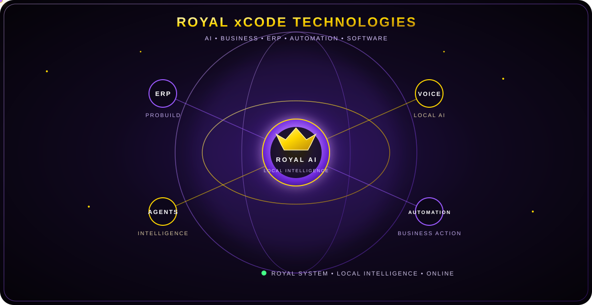

<div align="center">

# 👑 Royal xCode Technologies

### AI • Business • ERP • Automation • Software



</div>

---

## 👑 About Royal xCode Technologies

**Royal xCode Technologies** is a technology initiative focused on building practical AI-powered software for businesses.

The vision is simple:

> **Build intelligent systems that help businesses operate faster, smarter, and with less manual work.**

Our work combines:

- 🤖 Artificial Intelligence
- ⚙️ Business Automation
- 🏢 ERP Systems
- 📊 Business Intelligence
- 🧠 Local AI
- 💻 Modern Web Applications
- 🔗 AI Agents
- 🛠️ Custom Business Software

---

# 🚀 Royal Technology Ecosystem

<div align="center">

### 🧠 ROYAL AI OS

**The central AI operating environment**

AI Workspace • AI Chat • AI Agents • Business Intelligence • Knowledge Base

⬇️

### 🏢 ROYAL PROBUILD ERP

**Business management infrastructure**

CRM • Projects • Properties • Sales • Installments • Accounting • Expenses • Reports

⬇️

### 👔 ROYAL TROVE AI

**AI-powered fashion technology**

Virtual Try-On • AI Fashion Concepts • Digital Experiences

⬇️

### 🎙️ ROYAL VOICE

**Local desktop AI assistant**

Voice Commands • Local LLM • Speech Recognition • Text-to-Speech • Desktop Automation

</div>

---

# 🧠 Royal AI OS

**Royal AI OS** is the flagship software environment being developed by Royal xCode Technologies.

### Core Modules

- 🖥️ AI Dashboard
- 💬 AI Chat
- 🤖 AI Agents
- 🏢 Royal ProBuild ERP
- 👔 Royal Trove
- 📈 Analytics
- 🧠 Knowledge Base
- ⚙️ System Settings

---

# 🤖 AI Agent Ecosystem

| Agent | Responsibility |
|---|---|
| 👑 CEO Agent | Strategic intelligence |
| 🏢 ERP Agent | Business operations |
| 💰 Finance Agent | Financial intelligence |
| 📣 Marketing Agent | Marketing automation |
| 👔 Royal Trove Agent | Fashion intelligence |
| 🤝 SA Trading Agent | Trading & business support |

---

# 🏢 Royal ProBuild ERP

A modular ERP architecture designed around real-world business workflows.

### Current Business Areas

**CRM**  
Customer records, relationships and business communication.

**Projects**  
Project management, tracking and operational visibility.

**Properties**  
Property management and development workflows.

**Units**  
Unit-level management and customer linking.

**Sales**  
Sales workflow and customer transactions.

**Installments**  
Installment planning and payment tracking.

**Accounting**  
Business financial records and accounting workflows.

**Expenses**  
Operational expense management.

**Reports**  
Business reporting and management intelligence.

---

# 🎙️ Royal Voice

### ROYAL VOICE • LOCAL INTELLIGENCE ENVIRONMENT

A desktop-first AI assistant designed to bring natural voice interaction to the Royal ecosystem.

### Technology

- 🎤 Speech Recognition
- 🧠 Local LLM
- 🔊 Text-to-Speech
- 🖥️ Desktop Automation
- ⚡ Local Processing
- 🔐 Privacy-Focused Architecture

The goal:

> **A practical local AI assistant that can understand, respond and operate the desktop environment.**

---

# 🤖 AI + Automation

Royal xCode focuses on connecting AI with actual business operations.

<div align="center">

```text
USER
  │
  ▼
ROYAL AI
  │
  ├── AI CHAT
  │
  ├── AI AGENTS
  │
  ├── BUSINESS DATA
  │
  └── AUTOMATION
        │
        ▼
  BUSINESS ACTION
```

</div>

The objective is not simply to build AI demos.

> **The objective is to build useful systems.**

---

# ⚡ Technology Stack

<div align="center">

### Frontend

**React • TypeScript • Vite • Tailwind CSS**

### Backend & Database

**Python • Supabase • PostgreSQL**

### AI

**Local LLMs • Ollama • Whisper • AI Agents**

### Development

**Git • GitHub • GitHub Desktop • VS Code**

</div>

---

# 🧩 Engineering Principles

### 01 — Build Practical

Software should solve real problems.

### 02 — Automate Repetitive Work

If a process can be automated, it should be considered for automation.

### 03 — AI With Purpose

AI should improve workflows, decisions and productivity.

### 04 — Modular Architecture

Systems should be expandable without rebuilding everything.

### 05 — Local Intelligence

Where practical, local AI can provide speed, privacy and control.

---

# 📈 Current Focus

<div align="center">

```text
             ROYAL AI OS
                  │
       ┌──────────┼──────────┐
       │          │          │
      ERP       AGENTS     VOICE
       │          │          │
       └──────────┼──────────┘
                  │
             AUTOMATION
                  │
                  ▼
       BUSINESS INTELLIGENCE
```

</div>

### Current Priority

**Turning Royal AI OS into a practical AI-powered business platform.**

---

# 🌐 Royal xCode Technologies

The long-term objective is to build a connected ecosystem where:

```text
                    ROYAL AI
                       │
          ┌────────────┼────────────┐
          │            │            │
         ERP         VOICE        AGENTS
          │            │            │
          └────────────┼────────────┘
                       │
                  AUTOMATION
                       │
                       ▼
             BUSINESS INTELLIGENCE
```

A single technology ecosystem connecting:

**AI + ERP + Automation + Business Intelligence**

---

# 🔭 Long-Term Vision

Royal xCode Technologies aims to evolve toward a broader AI-powered business ecosystem.

```text
AI
│
├── Business Systems
│
├── ERP
│
├── Automation
│
├── AI Agents
│
├── Voice Interfaces
│
├── Business Intelligence
│
└── Intelligent Digital Experiences
```

### The Vision

> **Create technology that works with people, not against them.**

---

# ⭐ Featured Project

<div align="center">

## 👑 Royal AI OS

**AI-powered business operating environment**

AI • ERP • Automation • Agents • Analytics

<br>

<a href="https://github.com/royaldeveloperserp-lab/Royal-AI-OS">
<strong>🚀 EXPLORE ROYAL AI OS →</strong>
</a>

</div>

---

# 💡 Areas of Interest

<div align="center">

**Artificial Intelligence**  
**AI Automation**  
**Business Software**  
**ERP Systems**  
**AI Agents**  
**Local AI**  
**Business Intelligence**  
**Voice Assistants**  
**Software Architecture**  
**Digital Transformation**

</div>

---

# 👑 Royal Philosophy

<div align="center">

## THINK BIG

### BUILD PRACTICAL

## AUTOMATE INTELLIGENTLY

### KEEP IMPROVING

<br>

**AI is not the destination.**

**AI is the engine.**

</div>

---

<div align="center">

### 👑 Royal xCode Technologies

**AI • Business • ERP • Automation • Software**

<br>


<br><br>

**ROYAL SYSTEM • LOCAL INTELLIGENCE • ONLINE**

</div>